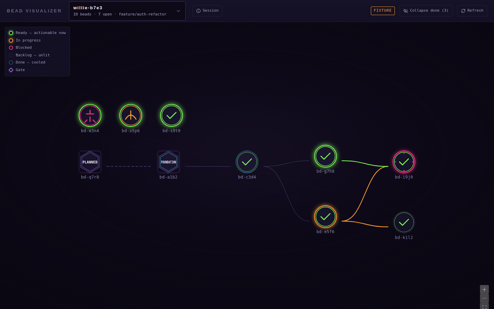

# Bead Visualizer

A local, single-user web app that reads a `beads` (`bd`) database, renders one
session's dependency DAG as glowing circular agent nodes connected by curved neon
tubing, and lets you retire finished sessions.



```bash
npm install
npm run build
npm start                    # http://127.0.0.1:5177

# or, with no bd installed — a fixture database for demos and development
node scripts/make-fixture.mjs --out fixtures/demo.json
npm start -- --fixture fixtures/demo.json
```

For development with HMR, run the two halves separately:

```bash
npm run dev:server -- --fixture fixtures/demo.json    # sidecar on 5177
npm run dev:web                                       # vite on 5178, proxies to it
```

---

## What it assumes about your beads

`bd` has no notion of a session, an agent, or a gate. All three are conventions,
so all three are read from labels and all three are configurable in
`beadviz.config.json`. The defaults match
[`.kiro/prompts/bead-conventions.md`](../.kiro/prompts/bead-conventions.md):

| Question | Answer for this database | Config key |
|---|---|---|
| What carries the session ID? | The `willie-{4-hex}` label Willie puts on every bead in a planning session. | `sessionLabelPattern` |
| How does an agent identify itself? | Bare agent-name labels. A bead carries its author twice (`willie` **and** `from-willie`) and its recipient once (`flanders`), so the **recipient** — whoever has to act — is the one with no `from-` twin. An explicit assignee wins if the database has one. | `agentLabels` |
| Do gates have a bead type? | No, so it is a heuristic: a bead carrying `exit:<EMIT>` (the closing bead that names the next agent) or `foundation` (the thing everything waits on) renders as a hexagon. | `gateLabels`, `gateLabelPrefixes` |
| Are sessions ephemeral (wisps)? | No. `bd prune` is the primary retire path; `bd purge` is offered as a second mode. | — |
| Rough scale? | A planning session is 5–30 beads. The elk worker and the collapse-done toggle are still there, because the 200-bead case is 900 ms with them and unusable without. | — |

Change any of these and nothing else has to change:

```jsonc
{
  "repoRoot": "..",                                  // the checkout that owns .beads/
  "sessionLabelPattern": "^willie-[0-9a-f]{4}$",
  "agentLabels": ["willie", "frink", "drnick", "flanders", "tod", "bart", "lisa"],
  "gateLabelPrefixes": ["exit:"],
  "scopeArgsTemplate": ["--label", "{session}"]      // how a prune is scoped to a session
}
```

## Avatars: bring your own files

The app bundles no character art and fetches none. It reads whatever is in
`avatars/`, keyed by a manifest:

```json
{
  "version": 1,
  "fallback": "generic-agent.svg",
  "agents": {
    "flanders": { "file": "flanders.svg", "label": "Flanders", "hue": "#7CFF4F" }
  }
}
```

The files currently in `avatars/` are abstract geometric placeholders — one glyph
per agent in the roster — there to prove the pipeline works and to be overwritten.
Drop your own PNGs or SVGs in, point the manifest at them, and reload. A bad entry
drops out with a warning rather than breaking the graph; an unmapped agent gets the
generic fallback.

`hue` tints the node's **inner** ring. It is deliberately not the outer ring — see
"Where this deviates" below.

## Endpoints

| Method | Path | Returns |
|---|---|---|
| `GET` | `/api/health` | source, paths, `bd` version, and any first-class problem |
| `GET` | `/api/sessions` | `[{ id, label, beadCount, openCount, lastActivity, branches[] }]` |
| `GET` | `/api/sessions/:id/graph` | `{ nodes[], edges[], meta }` |
| `GET` | `/api/beads/:beadId` | full detail for the drawer |
| `POST` | `/api/sessions/:id/purge/preview` | parsed dry-run |
| `POST` | `/api/sessions/:id/purge/execute` | requires `{ confirm: true, mode, ignoreReferences }` |
| `GET` | `/api/events` | SSE: `beads-changed`, `purge-progress` |
| `GET` | `/api/prefs`, `PUT /api/prefs` | the only state this app owns |
| `GET` | `/avatars/*` | static, from the configured folder |

## Safety

The sidecar spawns a CLI with names that came from a browser, so:

- It binds `127.0.0.1` explicitly, never `0.0.0.0`.
- Every CLI call is `execFile` with an argv array. No `shell: true`, no interpolation.
- Session and bead identifiers are allowlisted against `^[A-Za-z0-9._-]{1,64}$` at
  the HTTP boundary, before they can reach an argv slot.
- **A prune is never run unscoped.** If `scopeArgsTemplate` does not mention
  `{session}`, or `bd` rejects the scoping flag, the request fails with an
  explanation. It never falls back to a database-wide prune.
- `--force` is never sent without a dry-run immediately preceding it in the same
  request — which both re-checks the plan and proves the scope flag still parses.
- `--ignore-references` is a separately-checked box that only appears when there is
  something it would actually delete.

## Retiring a session

Four steps, and the destructive control is unreachable until the previous step has
rendered real data:

1. **Entry** — in the session popover, labelled *"Retire session…"*, not red at rest.
2. **Preview** — runs `bd <mode> --dry-run` and shows what goes, what stays because
   it is still open, and what stays because open work cites it (naming the citing
   bead, which is the non-obvious one).
3. **Confirm** — type the session ID. `--ignore-references` is a separate opt-in.
4. **Execute** — `--force`, then `bd flatten`, then a toast saying exactly what
   happened, because a session row vanishing from the list is correct but startling.

Reference protection is computed locally as well as parsed from the CLI, and the
two are merged so that the CLI's answer wins where it spoke and the local
derivation fills the rest. Two asymmetries in that merge are deliberate: a bead the
CLI protected is never demoted to deletable, and an open bead is never shown as
deletable whatever the text seemed to say — `prune` cannot delete one, and showing
otherwise would misrepresent what the confirm button does.

## Where this deviates from the spec, and why

Four places, each because building it as written produced something worse:

1. **The agent hue is an inner ring, not the status ring.** Tinting the status ring
   with the agent's colour makes a lime-hued agent's *blocked* bead look *ready* —
   it destroys the one rule the palette rests on. Status owns the outer ring and the
   glow; the agent gets a thin concentric ring inside it, at an opacity scaled to
   the status's own emission so an unlit backlog bead stays unlit.

2. **The gate caption comes from the server, not a regex over the title.** The
   sidecar already has the labels that made it a gate, so it returns `gateName`
   alongside `isGate`.

3. **The Google Fonts stylesheet loads non-blocking.** As a plain `<link>` it is
   render-blocking, and on a machine that cannot reach `fonts.googleapis.com` the
   whole app waits for the request to time out — measured at 12.6 s behind a
   connection reset. A local tool has no business being unusable because a CDN is
   unreachable. Fallback stacks carry the design until the sheet lands.

4. **`--text-lo` is not used for the bead ID caption.** The spec allows it there and
   also says `--text-lo` is "never anything load-bearing" — but the always-visible
   ID caption is precisely load-bearing, and `#6B6389` on `--void` is 3.58:1, under
   the text floor. There is a new `--text-caption` token, same violet cast, tuned to
   clear 4.5:1 on `--void`, `--panel` and `--panel-hi`. `--text-lo` now appears only
   on the branding marquee and three icon glyphs.

## Verified

Measured in Chromium against the generated fixtures, not assumed:

| | |
|---|---|
| 200 nodes / 272 edges | 915 ms from navigation to a laid-out graph |
| Hover → transitive highlight painted | 116 ms at 200 nodes (19 lit, 181 dimmed, 20 edges) |
| Scroll/zoom under load | 18.9 ms median frame, 45.6 ms p95 |
| `prefers-reduced-motion: reduce` | power-on, flicker and edge transitions all report `animation-name: none`; the `powering` class is never applied |
| Contrast | every token pair checked against its floor; no failures |
| Keyboard | Tab reaches the combobox, the three header controls, then every node in topological order; focus ring is 2 px `--hot-core` throughout; the retire modal traps Tab and closes on Escape |
| Parsers | 133 unit tests over the envelope, normalizer, dependency, graph-building and purge layers |

The one thing that could not be verified here is `bd` itself — it is not installed
in this environment, so every CLI call is exercised against the fixture backend and
the parsers are tested against both the JSON and human-readable output shapes that
`bd` is known to produce. **Run `npm start` against a real database before trusting
the retire flow**, and if `bd list` rejects its flags, adjust `listCandidates` in
the config rather than patching code.

## Layout

```
shared/          the wire contract, imported by both halves
server/
  src/bd/        envelope, normalize, labels, deps, build, purge — all pure, all tested
  src/backend.ts BdBackend (execFile) and FixtureBackend (a JSON file)
  test/          133 vitest cases over the parsing layer
web/
  src/graph/     elk worker, topology, the neon node and edge, the highlight store
  src/components/selector, drawer, retire dialog, notices, toasts
  src/styles/    tokens.css is the design system
avatars/         yours to replace
fixtures/        generated; --stress builds the 200-bead case
scripts/         make-fixture.mjs
```
